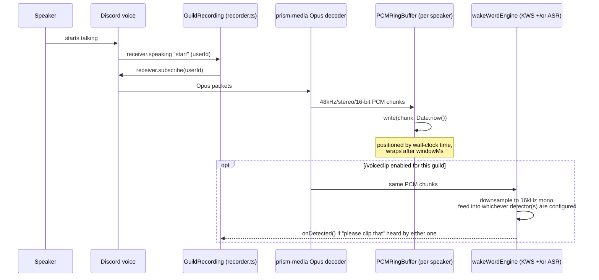
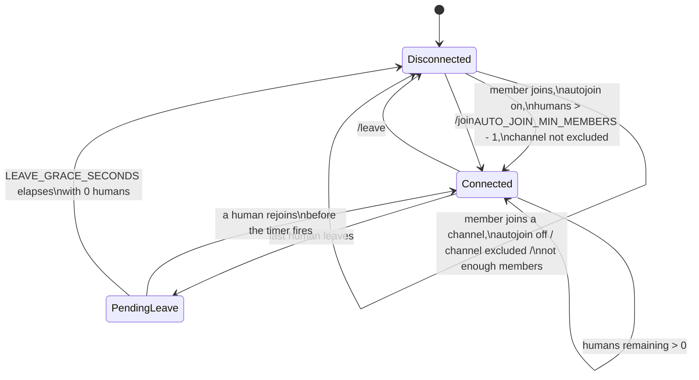

# Discord Audio Clipper — End-to-End Guide

This is the deep-dive companion to the [README](../README.md): how the bot is
built, how audio actually flows through it, every command and config option,
how to run it in production, and how to debug it when something goes wrong.

## Contents

1. [Overview](#1-overview)
2. [Architecture](#2-architecture)
3. [The recording pipeline](#3-the-recording-pipeline)
4. [Auto-join, auto-leave, and the leave grace period](#4-auto-join-auto-leave-and-the-leave-grace-period)
5. [Settings persistence](#5-settings-persistence)
6. [Voiceclip Clip-That Setup](#6-voiceclip-clip-that-setup)
7. [Setup, from zero](#7-setup-from-zero)
8. [Configuration reference](#8-configuration-reference)
9. [Command reference](#9-command-reference)
10. [Running in production](#10-running-in-production)
11. [Troubleshooting](#11-troubleshooting)
12. [Project layout / extending the bot](#12-project-layout--extending-the-bot)

---

## 1. Overview

The bot solves one problem: **"someone said something funny/important five
minutes ago, I wish I'd been recording."** Instead of recording on demand
(too late) or recording and saving everything forever (a privacy and storage
problem), it keeps a small rolling buffer of the last few minutes per
speaker, in memory only, and only turns that into a real file when someone
explicitly asks for a clip — either with `/clip`, or by saying **"clip
that"** out loud if `/voiceclip` is enabled.

Nothing touches disk while recording. A clip only exists as a file for the
few seconds between "someone asked for one" and "Discord finished receiving
the upload," after which it's deleted.

## 2. Architecture

```mermaid
flowchart TB
    subgraph Discord
        VC[Voice Channel]
        Gateway[Gateway events]
    end

    subgraph Bot process
        Index[index.ts<br/>client wiring]
        Commands[commands/*.ts<br/>join · leave · clip · autojoin · voiceclip]
        Connect[voice/connect.ts<br/>joinVoiceChannel + start recording]
        Recorder[voice/recorder.ts<br/>GuildRecording]
        Ring[voice/ringBuffer.ts<br/>PCMRingBuffer per speaker]
        Mixer[voice/mixer.ts<br/>mix + ffmpeg encode]
        WakeEngine[voice/wakeWordEngine.ts<br/>fans audio out to configured detectors]
        Wake[voice/wakeWord.ts<br/>KWS "please clip that" detector]
        Transcriber[voice/transcriber.ts<br/>Whisper transcription detector]
        WakeClip[voice/wakeClip.ts<br/>clip + post on detection]
        Notify[voice/notifySound.ts<br/>plays confirmation chime]
        LeaveGrace[voice/leaveGrace.ts<br/>debounced auto-leave]
        Store[store/settingsStore.ts<br/>JSON-backed guild settings]
    end

    Disk[(data/settings.json)]

    VC -- opus audio packets --> Recorder
    Gateway -- interactionCreate / voiceStateUpdate --> Index
    Index --> Commands
    Commands --> Connect
    Connect --> Recorder
    Connect --> WakeClip
    Recorder --> Ring
    Recorder --> WakeEngine
    WakeEngine --> Wake
    WakeEngine --> Transcriber
    Wake -- "wakeword" event --> WakeEngine
    Transcriber -- "wakeword" event --> WakeEngine
    WakeEngine -- "wakeword" event --> Recorder
    Recorder -- "wakeword" event --> WakeClip
    WakeClip --> Notify
    Notify -- chime --> VC
    WakeClip --> Mixer
    WakeClip -- posts mp3 --> VC
    Commands -- "/clip" --> Mixer
    Mixer -- reads --> Ring
    Mixer -- mp3 file --> Commands
    Index --> LeaveGrace
    Index --> Store
    Commands --> Store
    Store <--> Disk
```

- **`index.ts`** owns the Discord client, dispatches slash-command
  interactions to the matching `commands/*.ts` module, and holds the
  `voiceStateUpdate` listener that drives auto-join and auto-leave.
- **`commands/`** — one file per slash command (`join`, `leave`, `clip`,
  `autojoin`, `voiceclip`). Each exports a `Command` (`data` = the slash
  command definition, `execute` = the handler).
- **`voice/connect.ts`** wraps `@discordjs/voice`'s `joinVoiceChannel` +
  waiting for the `Ready` state, starts the recording, and wires up wake-word
  handling. Both `/join` and auto-join call this so there's exactly one code
  path for "connect and start recording."
- **`voice/recorder.ts`** owns one `GuildRecording` per guild that's
  currently connected. It subscribes to each user's Opus audio as they start
  speaking, decodes it to PCM, and (if `/voiceclip` is enabled) feeds it to a
  wake-word detector too. `GuildRecording` is an `EventEmitter` that emits
  `'wakeword'` on a detection.
- **`voice/ringBuffer.ts`** is a fixed-size circular buffer of raw PCM,
  one per speaker, indexed by wall-clock time (see [§3](#3-the-recording-pipeline)).
- **`voice/mixer.ts`** reads the requested window from every speaker's ring
  buffer, sums them into one mix, and shells out to `ffmpeg` to encode an
  mp3. Used by both `/clip` and the wake-word handler.
- **`voice/wakeWordEngine.ts`** is the entry point `recorder.ts` uses for
  wake-word detection: per speaker, it creates whichever of the two engines
  below are configured and fans that speaker's PCM out to all of them, firing
  the same detection callback if either one hears "please clip that".
- **`voice/downsample.ts`** holds the shared 48kHz-stereo → 16kHz-mono
  downmixing both engines below need, since sherpa-onnx models expect that
  input format either way.
- **`voice/wakeWord.ts`** wraps a single shared sherpa-onnx keyword-spotting
  (KWS) model (loaded once for the whole process), creating a lightweight
  per-speaker stream that downsamples their PCM and feeds it in to detect a
  fixed phrase baked into a keywords file (see [§6](#6-voiceclip-clip-that-setup)).
- **`voice/transcriber.ts`** is the optional second detector: a shared
  offline sherpa-onnx Whisper model. Unlike the always-on KWS stream, it
  buffers each speaker's PCM for one speaking session and transcribes the
  whole utterance in one shot once they stop talking, matching the
  transcript against configurable `WAKE_WORD_PHRASES` instead of a fixed
  keywords file (see [§6](#6-voiceclip-clip-that-setup)).
- **`voice/wakeClip.ts`** listens for a `GuildRecording`'s `'wakeword'`
  event (which carries the triggering `userId` and the matched `phrase`),
  debounces repeated triggers, plays a confirmation chime
  (`voice/notifySound.ts`) right away, then clips the last
  `WAKE_WORD_CLIP_SECONDS` via the mixer and posts it - mentioning who
  triggered it and which phrase they said - to the configured channel (or
  the voice channel's own chat).
- **`voice/notifySound.ts`** plays a short pre-rendered chime
  (`assets/clip-notify.pcm`) into the voice channel via a throwaway
  `AudioPlayer` — the only place the bot outputs audio.
- **`voice/leaveGrace.ts`** holds the per-guild "about to leave" timers used
  by auto-leave (see [§4](#4-auto-join-auto-leave-and-the-leave-grace-period)).
- **`store/settingsStore.ts`** is the only piece of state that outlives a
  process restart — see [§5](#5-settings-persistence).

## 3. The recording pipeline



1. **Join.** `/join` (or auto-join) calls `connectAndRecord`, which opens a
   voice connection and calls `recorder.startRecording(guildId, connection)`.
   That creates a `GuildRecording`, which listens for the connection's
   `receiver.speaking` `"start"` event.
2. **Per-speaker subscription.** The first time a user speaks, the recorder
   subscribes to their Opus stream (`EndBehaviorType.AfterSilence`, closing
   after 100ms of silence) and pipes it through `prism-media`'s Opus decoder
   to get raw PCM. It re-subscribes automatically the next time they speak
   after a silence-triggered close.
3. **Writing into the ring buffer.** Each speaker gets their own
   `PCMRingBuffer` (created lazily, sized to `RECORD_WINDOW_SECONDS`). Writes
   are positioned **by wall-clock time**, not arrival order: `write()` fills
   any gap since the last write with silence and always writes at
   `posFor(timestamp)`. This is what lets `/clip` mix multiple speakers by
   simple index-aligned addition — sample *N* in every user's buffer
   corresponds to the same instant — instead of needing to timestamp-align
   streams after the fact.
4. **Wake-word detection (optional).** If `/voiceclip enable` has been run
   for the guild and at least one wake-word engine is configured, the same
   PCM chunks are also handed to a per-speaker detector created by
   `wakeWordEngine.ts` — the KWS detector (`wakeWord.ts`), the transcription
   detector (`transcriber.ts`), or both, if both are configured. Both
   downsample 48kHz stereo to 16kHz mono (a clean 3:1 ratio, shared via
   `downsample.ts`), but decode differently: KWS feeds each chunk straight
   into its own lightweight sherpa-onnx stream (`acceptWaveform` + a `decode`
   loop while the stream reports it's ready) and checks for a non-empty
   `keyword` continuously, as speech comes in. The transcription detector
   instead buffers the downsampled audio and only transcribes it in one shot,
   via an offline Whisper model, once the speaker stops talking (its
   `destroy()`, called when the recorder's silence-triggered subscription
   closes) — checking the transcript for any of `WAKE_WORD_PHRASES`. Either
   one detecting the phrase fires the `GuildRecording`'s `'wakeword'` event —
   see [§6](#6-voiceclip-clip-that-setup).
5. **Clipping.** Both `/clip [seconds]` and a wake-word detection call
   `mixer.createClip`, which:
   - computes `[startMs, endMs)` for the requested window, clamped to both
     `RECORD_WINDOW_SECONDS` and how long the bot has actually been
     recording (so you can't get silence-padding from before you joined);
   - reads that window out of every speaker's ring buffer;
   - sums the buffers sample-by-sample into one `Int32Array`, then scales
     the whole mix down by its peak (not per-sample clipping) so multiple
     people talking at once doesn't distort;
   - pipes the mixed PCM into `ffmpeg` (via `fluent-ffmpeg` +
     `ffmpeg-static`, no system ffmpeg install needed) and encodes to a
     128kbps mp3 in the OS temp directory;
   - the caller uploads that file as a Discord attachment, then calls
     `mixer.cleanupClip` to delete it.
6. **Leaving.** `recorder.stopRecording(guildId)` unhooks the `speaking`
   listener and drops all buffers — recorded audio for that guild is gone
   the moment the bot leaves. Per-speaker keyword-spotting streams are
   dropped along with their subscriptions as speakers stop talking; the
   shared model itself stays loaded for the life of the process.

## 4. Auto-join, auto-leave, and the leave grace period

`index.ts`'s `voiceStateUpdate` handler runs on every join/leave/move in
every voice channel and does two unrelated things depending on whether the
bot is already connected in that guild:



- **Bot already connected in this guild:** count humans left in the bot's
  current channel. Zero humans schedules an auto-leave via
  `leaveGrace.scheduleLeave` (a no-op if one's already pending); anyone
  present cancels a pending one. The scheduled callback re-checks the
  channel when it actually fires — if everyone left and came back within
  `LEAVE_GRACE_SECONDS`, nothing happens. This exists because a client hiccup
  or a quick channel hop used to instantly kill the recording buffer.
- **Bot not connected in this guild:** if `/autojoin enable` has been run
  for the guild, the channel the member just joined isn't on the exclude
  list, and it now has more than `AUTO_JOIN_MIN_MEMBERS - 1` humans in it,
  the bot calls the same `connectAndRecord` helper `/join` uses.

`/leave` bypasses all of this: it cancels any pending scheduled leave and
destroys the connection immediately.

## 5. Settings persistence

`/autojoin` and `/voiceclip`'s enabled/disabled state, the excluded-channel
list, and the configured clip-post channel are the only state that needs to
survive a restart (recording buffers are intentionally ephemeral).
`store/settingsStore.ts` keeps an in-memory `Record<guildId, GuildSettings>`
that's read from `<DATA_DIR>/settings.json` on startup and rewritten (via
write-to-temp-file-then-rename, so a crash mid-write can't corrupt it) after
every change:

```json
{
  "123456789012345678": {
    "autoJoinEnabled": true,
    "autoJoinExcludedChannelIds": ["234567890123456789"],
    "voiceClipEnabled": true,
    "voiceClipChannelId": "345678901234567890"
  }
}
```

`voiceClipChannelId` is `null` (the default) when no channel has been set
with `/voiceclip channel set` — in that case clips post to whichever voice
channel's own text chat the phrase was said in.

`DATA_DIR` defaults to `./data` (gitignored) and can point anywhere writable
— see [§8](#8-configuration-reference) if you need it on a persistent volume
in a container.

## 6. Voiceclip Clip-That Setup

`/voiceclip` lets anyone say **"please clip that"** out loud instead of typing
`/clip`. Detection runs on [sherpa-onnx](https://github.com/k2-fsa/sherpa-onnx)
(specifically its Node binding,
[`sherpa-onnx-node`](https://www.npmjs.com/package/sherpa-onnx-node)) — an
Apache-2.0, fully offline speech toolkit with a purpose-built **keyword
spotting (KWS)** mode: a tiny model that only recognizes a fixed list of
phrases you give it, rather than doing general transcription. No account, no
API key, no per-use cost, and no usage cap — you just need one free
pretrained model file and a short one-time step to teach it the phrase
"please clip that".

This is a one-time setup by whoever **runs** the bot (not per-server — it's
a bot-wide deployment step, same as `DISCORD_TOKEN`), done once on any
machine with Python, then shipped to wherever the bot actually runs.

### Automated: `scripts/setup-voiceclip.sh`

The fastest path — downloads the model, generates the keywords file, and
writes the five `KWS_*` paths straight into `.env`:

```bash
npm run setup-voiceclip
```

Add `-- --with-asr` to also set up the [optional transcription-based
check](#optional-transcription-based-trigger-check) below in the same run:

```bash
npm run setup-voiceclip -- --with-asr
```

Re-running it is safe: it skips a download if that model's already there,
and only overwrites the `KWS_*` (and, with `--with-asr`, `ASR_*`/
`WAKE_WORD_PHRASES`) lines in `.env`, leaving everything else untouched.
Useful flags (`scripts/setup-voiceclip.sh --help` for the full list):

| Flag | Default | Effect |
|---|---|---|
| `--phrase "please clip that,clip that"` | `please clip that` | Comma-separated trigger phrase(s) to teach the KWS model - one keyword line is generated per phrase |
| `--score` / `--threshold` | `2.0` / `0.35` | Baked into every phrase's line in the generated keywords file — see step 4 below for what these do |
| `--out-dir` | `data/kws-model` | Where the KWS model + generated `keywords.txt` are stored (already gitignored) |
| `--env-file` | `.env` | Which file to write the env vars into |
| `--fp32` | *(off = int8)* | Use full-precision model files instead of the smaller/faster int8 ones (applies to both KWS and, with `--with-asr`, ASR) |
| `--print-only` | *(off)* | Print the env vars instead of writing them to `--env-file`, if you'd rather manage them yourself |
| `--with-asr` | *(off)* | Also download a small offline Whisper ASR model (~113MB) and write `ASR_*`/`WAKE_WORD_PHRASES` |
| `--wake-word-phrases "please clip that,clip that"` | *(same as `--phrase`)* | Comma-separated phrases the transcription check matches; only relevant with `--with-asr` |
| `--asr-out-dir` | `data/asr-model` | Where the ASR model is stored (already gitignored); only relevant with `--with-asr` |

It needs `python3`, `pip3`, `tar`, and `curl` or `wget` on the machine it
runs on; it installs the `sherpa-onnx` Python package (and its `click`
runtime dependency, which that package doesn't always declare on its own)
automatically if `sherpa-onnx-cli` isn't already on `PATH` — this is only
needed for the KWS keywords-file step, not for `--with-asr`, which involves
no Python tooling beyond what's already required.

The rest of this section is what the script automates, spelled out for
reference or if you'd rather run it by hand:

1. **Download a pretrained English KWS model** (no login required) — a tiny
   3.3M-parameter Zipformer trained on GigaSpeech, about 5-13MB depending on
   which of its `.onnx` files you use:
   ```bash
   wget https://github.com/k2-fsa/sherpa-onnx/releases/download/kws-models/sherpa-onnx-kws-zipformer-gigaspeech-3.3M-2024-01-01.tar.bz2
   tar xjf sherpa-onnx-kws-zipformer-gigaspeech-3.3M-2024-01-01.tar.bz2
   ```
   Other free models (including other languages) are listed at the
   [sherpa-onnx KWS pretrained models page](https://github.com/k2-fsa/sherpa-onnx/releases/tag/kws-models).
   The int8-quantized `*.int8.onnx` files are smaller and faster with
   negligible accuracy loss for a task this narrow — use those unless you
   have a reason not to.
2. **Generate a keywords file for "please clip that".** The model needs the phrase
   spelled out in its own BPE token vocabulary, produced by a small CLI tool
   that ships with the (separate, Python) `sherpa-onnx` package:
   ```bash
   pip install sherpa-onnx
   echo 'please clip that :2.0 #0.35 @clip_that' > keywords_raw.txt
   sherpa-onnx-cli text2token \
     --tokens sherpa-onnx-kws-zipformer-gigaspeech-3.3M-2024-01-01/tokens.txt \
     --tokens-type bpe \
     --bpe-model sherpa-onnx-kws-zipformer-gigaspeech-3.3M-2024-01-01/bpe.model \
     keywords_raw.txt keywords.txt
   ```
   In `keywords_raw.txt`, `:2.0` is a boosting score and `#0.35` a triggering
   threshold — both optional tuning knobs (see step 4) — and `@clip_that` is
   the label reported back as `KeywordResult.keyword` on a hit (spaces
   replaced with underscores). This step is local and instant; nothing is
   uploaded anywhere. (This is the only step that needs Python — the bot
   itself only needs the Node package, already in `package.json`.) To trigger
   on more than one phrase, add another line to `keywords_raw.txt` before
   running `text2token` — see [Adding another voice trigger
   phrase](#12-project-layout--extending-the-bot) below (the automated script
   does this for you when `--phrase` is given a comma-separated list).
3. **Ship both the model and `keywords.txt` with your deployment**
   somewhere the bot process can read them, and point five env vars at the
   exact files (see [`.env.example`](../.env.example)):
   ```
   KWS_ENCODER_PATH=/path/to/encoder-epoch-12-avg-2-chunk-16-left-64.int8.onnx
   KWS_DECODER_PATH=/path/to/decoder-epoch-12-avg-2-chunk-16-left-64.int8.onnx
   KWS_JOINER_PATH=/path/to/joiner-epoch-12-avg-2-chunk-16-left-64.int8.onnx
   KWS_TOKENS_PATH=/path/to/tokens.txt
   KWS_KEYWORDS_PATH=/path/to/keywords.txt
   ```
4. Restart the bot. `/voiceclip enable` will now work in any server it's in
   — it refuses to turn on and explains why if these aren't set. Tune
   detection by re-running step 2 with a different `:score`/`#threshold` in
   `keywords_raw.txt` (higher score / lower threshold = fewer misses, more
   false triggers), or override them at runtime without regenerating the
   file via `KWS_SCORE`/`KWS_THRESHOLD`. `WAKE_WORD_CLIP_SECONDS` (default
   `30`) controls how much audio a detection grabs.

`sherpa-onnx-node` ships prebuilt native bindings per platform (no
compilation step, unlike some alternatives — see the note in
[§10](#10-running-in-production) about matching platforms). The ONNX model
itself is loaded once and shared for the whole process; only a lightweight
per-speaker stream is created per speaking session, so the marginal cost of
having `/voiceclip` on is small even with several people talking at once.

### Optional: transcription-based trigger check

KWS only ever recognizes the exact phrase(s) baked into `keywords.txt`, which
makes it fast but occasionally prone to missing a trigger said in an unusual
way. As a second, parallel check, `voice/transcriber.ts` buffers each
speaker's audio for one speaking session and, once they stop talking,
transcribes the whole utterance in one shot with an **offline Whisper
model**, matching the transcript against a configurable list of trigger
phrases (`WAKE_WORD_PHRASES`, comma-separated, defaults to just "please clip
that"). When both `KWS_*` and `ASR_*` are configured, both run per speaker
and either one detecting the phrase fires the same `'wakeword'` event
(`voice/wakeWordEngine.ts` fans a speaker's audio out to whichever engines
are configured); when only one is configured, only that one runs.

Whisper specifically — rather than a continuously-streaming ASR model
matching KWS's design — was chosen after testing both approaches against
real "please clip that" recordings: a streaming zipformer ASR model (the
same model family KWS uses, just doing general transcription) missed or
garbled the phrase on every short/quiet clip tried, while an offline Whisper
decode of the same clips transcribed them correctly every time. The
tradeoff is latency: because Whisper needs the whole utterance, this check
only fires after the speaker pauses (whenever the recorder's
`EndBehaviorType.AfterSilence` subscription closes, currently 2 seconds of
silence — see [§3](#3-the-recording-pipeline)), not mid-sentence the way KWS
can. Decoding itself is fast (well under 100ms for the tiny model this repo
defaults to) and runs via sherpa-onnx's async decode API, so it doesn't
block the event loop voice I/O and Discord's heartbeats also run on.

### Automated: `scripts/setup-voiceclip.sh --with-asr`

```bash
npm run setup-voiceclip -- --with-asr
```

Downloads a small (~113MB) offline English Whisper model
(`sherpa-onnx-whisper-tiny.en`), and writes `ASR_ENCODER_PATH` /
`ASR_DECODER_PATH` / `ASR_TOKENS_PATH` / `WAKE_WORD_PHRASES` into `.env`,
alongside the `KWS_*` vars from the plain (non-`--with-asr`) run — see the
flag table above for `--wake-word-phrases`, `--asr-out-dir`, and how
`--fp32`/`--print-only` apply to it too. Unlike KWS, no `keywords.txt`
generation step is needed — Whisper transcribes arbitrary speech out of the
box, so `--with-asr` doesn't need `sherpa-onnx-cli`/Python tooling at all.

### Manual setup

1. Download any sherpa-onnx **offline Whisper model** (not a streaming/online
   model, and not a KWS model) — see the pretrained model list in the
   [sherpa-onnx releases](https://github.com/k2-fsa/sherpa-onnx/releases).
   The `.en` (English-only) variants are smaller and sufficient unless you
   need other languages.
2. Point `ASR_ENCODER_PATH` / `ASR_DECODER_PATH` / `ASR_TOKENS_PATH` at the
   downloaded model's files (see [`.env.example`](../.env.example)) — Whisper
   has no joiner file, unlike KWS/streaming transducer models.
3. Optionally set `WAKE_WORD_PHRASES` to a comma-separated list if you want
   more than one wording to trigger a clip (e.g.
   `please clip that,clip that,clip it`). Matching is case-insensitive and
   ignores punctuation.
4. Restart the bot. This is independent of the `KWS_*` setup above — you can
   run either one alone or both together.

This check runs once per speaking session rather than continuously, so its
CPU cost scales with how often people talk (and pause) rather than with
audio duration - see the latency note above for the tradeoff that comes with
it.

Per-server, once the bot is configured:

- `/voiceclip enable` turns detection on for that server.
- As soon as "please clip that" is heard, the bot plays a short chime into the
  voice channel — immediate feedback that it caught the trigger, before the
  clip itself has even been mixed. This needs the **Speak** permission;
  without it the chime just won't be audible (Discord doesn't reliably
  surface that as a catchable error the way REST calls do) but detection,
  clipping, and posting are unaffected either way.
- `/voiceclip channel set #announcements` posts clips there instead of the
  voice channel's own chat; `/voiceclip channel clear` reverts to that
  default. Posting to the voice channel's own chat uses discord.js's
  "sendable channel" support for voice channels directly — no separate text
  channel is required. If posting to a configured channel fails (wrong
  permissions, deleted channel, etc.), the bot automatically retries in the
  voice channel's own chat instead of dropping the clip — see
  [§11](#11-troubleshooting) if neither works.
- Detection only runs while the bot is actually recording in that guild
  (via `/join` or auto-join) — enabling `/voiceclip` alone doesn't connect
  the bot anywhere.
- Repeated triggers are debounced to one clip per 10 seconds per guild, so
  several people saying the phrase around the same time (or someone
  repeating it) only produces one clip.

## 7. Setup, from zero

1. **Create the Discord application.**
   [Discord Developer Portal](https://discord.com/developers/applications) →
   New Application. Under **Bot**, copy the token (you'll only see it once —
   regenerate it if you lose it). Under **OAuth2 → General**, copy the
   Application (Client) ID.
2. **No privileged intents needed.** The bot only uses `Guilds` and
   `GuildVoiceStates`, neither of which requires enabling anything under
   **Bot → Privileged Gateway Intents**.
3. **Invite the bot.** Build an invite URL with the `bot` and
   `applications.commands` scopes and the **Connect**, **Speak**, and
   **View Channel** permissions. Speak is used for the short confirmation
   chime `/voiceclip` plays back when it hears "please clip that" — without it,
   recording and `/clip` still work fine, you just lose that audio cue. Add
   **Send Messages** too if you want `/voiceclip` to be able to post in
   voice channels' own text chat. You can generate this URL from
   **OAuth2 → URL Generator** in the portal.
4. **Install dependencies:**
   ```bash
   npm install
   ```
5. **Configure.** Copy `.env.example` to `.env` and fill in `DISCORD_TOKEN`
   and `CLIENT_ID`. Set `GUILD_ID` too while developing — guild-scoped
   commands register instantly, global ones can take up to an hour to
   propagate. The `KWS_*` variables are only needed if you want
   `/voiceclip` — see [§6](#6-voiceclip-clip-that-setup).
6. **Build:**
   ```bash
   npm run build
   ```
7. **Register the slash commands** (needed once, and again any time a
   command's definition changes):
   ```bash
   npm run deploy-commands
   ```
8. **Start the bot:**
   ```bash
   npm start
   ```

During development, skip the build step with `npm run dev` and
`npm run deploy-commands:dev` (both run the TypeScript sources directly via
`ts-node`).

## 8. Configuration reference

Everything is read once at startup from `.env` (via `dotenv`) or the process
environment — there's no live-reload, so restart after changing any of
these.

| Variable                | Required | Default   | Description |
|--------------------------|:--------:|-----------|--------------|
| `DISCORD_TOKEN`          | ✅       | —         | Bot token from the Developer Portal. |
| `CLIENT_ID`              | ✅       | —         | Application/client ID. |
| `GUILD_ID`               |          | *(global)* | If set, `deploy-commands` registers commands to this one guild instead of globally. Guild commands update instantly; global commands can take up to an hour. |
| `RECORD_WINDOW_SECONDS`  |          | `300`     | Size of the rolling per-speaker buffer. `/clip` can never return more than this, and memory use scales with it (roughly `RECORD_WINDOW_SECONDS × 192 KB` per distinct speaker). |
| `DEFAULT_CLIP_SECONDS`   |          | `300`     | How much `/clip` returns when called with no `seconds` argument. |
| `AUTO_JOIN_MIN_MEMBERS`  |          | `4`       | Auto-join fires once a channel has at least this many non-bot members — "more than 3" means `4`. Only takes effect in guilds where `/autojoin enable` has been run. |
| `LEAVE_GRACE_SECONDS`    |          | `10`      | Delay after a channel empties before the bot actually disconnects, to absorb brief drop-and-rejoin blips. |
| `DATA_DIR`               |          | `./data`  | Directory holding `settings.json` (per-guild auto-join and voice-clip settings). Must be writable; point it at a persistent volume in containerized deployments. |
| `KWS_ENCODER_PATH`       |          | —         | Path to the KWS model's encoder `.onnx` file. Required (with the four below), or `ASR_*` below, for `/voiceclip enable` to work — see [§6](#6-voiceclip-clip-that-setup). |
| `KWS_DECODER_PATH`       |          | —         | Path to the KWS model's decoder `.onnx` file. |
| `KWS_JOINER_PATH`        |          | —         | Path to the KWS model's joiner `.onnx` file. |
| `KWS_TOKENS_PATH`        |          | —         | Path to the KWS model's `tokens.txt`. |
| `KWS_KEYWORDS_PATH`      |          | —         | Path to the generated `keywords.txt` containing "please clip that". |
| `KWS_SCORE`, `KWS_THRESHOLD` |      | *(from file)* | Optional overrides for the boosting score / triggering threshold baked into `keywords.txt`, without regenerating it. |
| `KWS_DEBUG_AUDIO_DIR`    |          | —         | Debugging aid: when set, dumps the exact audio fed to the KWS model as a `.wav` file per speaking session into this directory, so you can listen to what the detector heard. |
| `WAKE_WORD_CLIP_SECONDS` |          | `30`      | How many seconds "please clip that" grabs. |
| `ASR_ENCODER_PATH`       |          | —         | Path to an offline Whisper model's encoder `.onnx` file, for the transcription-based trigger check. Optional and independent of `KWS_*` — either detecting the phrase triggers a clip. See [§6](#6-voiceclip-clip-that-setup). |
| `ASR_DECODER_PATH`       |          | —         | Path to the Whisper model's decoder `.onnx` file. |
| `ASR_TOKENS_PATH`        |          | —         | Path to the Whisper model's tokens file. |
| `WAKE_WORD_PHRASES`      |          | `please clip that` | Comma-separated trigger phrases the transcription check matches against a lowercased, punctuation-stripped transcript. |
| `VERBOSE` (or the `--verbose` CLI flag, e.g. `npm start -- --verbose`) |  | off | Logs every transcript the transcription check produces via `debugLog` (`src/log.ts`), not just the ones that match a trigger phrase - noisy, for debugging missed/garbled phrases. Detections and errors always log regardless. |

## 9. Command reference

All commands are guild-only. If the bot is installed with only the
`applications.commands` scope (no bot-user membership), every command
replies explaining that instead of silently timing out.

### `/join`

Connects to the voice channel you're currently in and starts recording.
Fails with "You need to be in a voice channel first" if you're not in one,
or "Could not connect to the voice channel in time" if the connection
doesn't reach the `Ready` state within 15 seconds (usually a permissions or
Discord-outage issue — see [§11](#11-troubleshooting)).

### `/leave`

Disconnects and immediately drops all recording buffers for the guild.
Replies "I'm not in a voice channel" if there's nothing to leave.

### `/clip [seconds]`

Mixes every speaker's buffer for the requested window and uploads an mp3.

- `seconds` is optional, defaults to `DEFAULT_CLIP_SECONDS`, and is capped
  at `RECORD_WINDOW_SECONDS` by the option's own min/max.
- If the bot hasn't been recording that long yet, the reply says so and
  returns whatever's actually been captured instead of padding with
  silence.
- Replies "I'm not currently recording in this server" if the bot isn't
  connected — run `/join` (or enable auto-join) first.

### `/autojoin`

Subcommands, all guild-scoped and persisted (see [§5](#5-settings-persistence)):

| Subcommand | Effect |
|---|---|
| `/autojoin enable` | Turns auto-join on for this server. |
| `/autojoin disable` | Turns auto-join off for this server. |
| `/autojoin status` | Shows on/off state and the current excluded-channel list. |
| `/autojoin exclude add <channel>` | Adds a voice/stage channel to the exclude list — it will never trigger auto-join, even above the member threshold. Useful for an AFK or lobby channel. |
| `/autojoin exclude remove <channel>` | Removes a channel from the exclude list. |

Auto-join itself only ever *joins*; it never overrides a manual `/leave`,
and it won't reconnect the bot into a different channel in the same guild
while it's already connected somewhere.

### `/voiceclip`

Subcommands, all guild-scoped and persisted (see [§5](#5-settings-persistence)
and [§6](#6-voiceclip-clip-that-setup)):

| Subcommand | Effect |
|---|---|
| `/voiceclip enable` | Turns "please clip that" detection on for this server. Fails with an explanatory error if the bot itself hasn't been configured with a keyword-spotting model. |
| `/voiceclip disable` | Turns detection off for this server. |
| `/voiceclip status` | Shows on/off state, the destination channel, and whether the bot has a wake-word engine configured at all. |
| `/voiceclip channel set <channel>` | Posts future "please clip that" clips to this text channel instead of the voice chat. |
| `/voiceclip channel clear` | Goes back to posting in whichever voice channel's own chat the phrase was said in. |

## 10. Running in production

The build output is plain Node — any process manager works. A minimal
`systemd` unit:

```ini
[Unit]
Description=discord-audio-clipper
After=network-online.target

[Service]
WorkingDirectory=/opt/discord-audio-clipper
EnvironmentFile=/opt/discord-audio-clipper/.env
ExecStart=/usr/bin/node dist/index.js
Restart=on-failure
RestartSec=5

[Install]
WantedBy=multi-user.target
```

Notes:

- Run `npm run build` as part of your deploy step; `npm start` (or the
  `ExecStart` above) only runs the compiled `dist/`.
- `npm run deploy-commands` only needs to run again when a command's
  *definition* changes (new option, renamed subcommand, etc.) — not on every
  deploy.
- Make sure `DATA_DIR` points somewhere that persists across deploys/restarts
  (a bind mount or volume, not an ephemeral container filesystem), or
  auto-join/voice-clip settings will silently reset.
- The process holds no other state worth persisting — recording buffers are
  meant to be lost on restart.
- ffmpeg is bundled via `ffmpeg-static`; no system package to install. Voice
  decode/encrypt use the pure-JS `opusscript` and `libsodium-wrappers`, so
  there's no native build step either — if CPU use under many concurrent
  guilds becomes a problem, installing `@discordjs/opus` and `sodium-native`
  alongside the existing deps lets `prism-media`/`@discordjs/voice` pick them
  up automatically as faster drop-ins.
- `sherpa-onnx-node` ships prebuilt native bindings per platform (Linux,
  macOS, Windows, several architectures) — no compilation step on install,
  and no matching requirement with the model/keywords files (those are
  plain ONNX/text and portable across platforms, unlike some wake-word
  engines' compiled keyword files).
- The KWS model itself is loaded once and shared process-wide. Every
  currently-speaking user gets their own lightweight decoding stream while
  `/voiceclip` is enabled; CPU use scales with how many people are talking
  concurrently across all guilds, not with the number of guilds themselves.
- Wake-word decoding is deferred with `setImmediate` so it can never delay
  the ring buffer write for the audio chunk that triggered it (recording
  correctness doesn't depend on `/voiceclip` keeping up). It still runs on
  the same single event loop as voice I/O and the Discord gateway/voice
  heartbeats, though — on an underpowered CPU with several people talking
  at once, a KWS backlog can still slow things down enough to affect voice
  connection stability. If you see reconnects or resets correlating with
  `/voiceclip` being enabled, that's the mechanism to suspect first; the
  int8 model (the default `setup-voiceclip.sh` downloads) is the lighter
  option over `--fp32`.

## 11. Troubleshooting

**"Could not connect to the voice channel in time."**
The connection didn't reach `Ready` within 15s. Usually: the bot lacks
**Connect** permission on that channel, the channel is full and permission
to bypass the user limit is missing, or Discord's voice infra is degraded.
Check the bot's role permissions in that specific channel (channel overrides
can revoke server-level permissions).

**"I'm not a member of this server, so I can't use its voice channels."**
The app was invited with only the `applications.commands` scope. Re-invite
with both `bot` and `applications.commands`.

**Slash commands don't show up, or show old options (e.g. `/autojoin`'s
old boolean `enabled` option instead of subcommands, or no `/voiceclip` at
all).**
Command definitions aren't live — you must re-run `npm run deploy-commands`
(or `:dev`) after changing a command's `SlashCommandBuilder` or adding a new
one. Global registration can also take up to an hour to propagate; set
`GUILD_ID` while iterating.

**Auto-join isn't triggering even with enough people in the channel.**
Check, in order: `/autojoin status` (is it actually enabled for this guild?
is that channel on the exclude list?), whether the bot is already connected
somewhere else in the guild (it won't jump channels while connected), and
`AUTO_JOIN_MIN_MEMBERS` (the count must be *greater than* threshold − 1,
i.e. strictly more than 3 by default).

**The bot leaves the instant everyone drops, even though I raised
`LEAVE_GRACE_SECONDS`.**
Confirm the env var is actually picked up — it's read once at process start,
so an edited `.env` needs a restart. Also note `/leave` always disconnects
immediately regardless of this setting; it's only for the automatic
everyone-left-the-channel path.

**`/clip` returns less audio than requested.**
Expected if the bot hasn't been connected that long yet — the reply says so
explicitly. If it's short even on a long-running session, check
`RECORD_WINDOW_SECONDS`; the buffer can never hold more than that regardless
of what `/clip`'s `seconds` argument asks for.

**`/clip <seconds>` seems to return the *start* of the session instead of
the most recent audio.**
This is the same "hasn't been connected that long yet" clamp above, just
easy to misread as reversed if the session is actually much shorter than it
looks — `mixer.createClip` clamps the window to `now - startedAtMs`, so if
the recording session itself is short, "the last N seconds" and "the whole
session so far" are the same thing. Check the process log for
`Restarting recording for guild ...` around the time you tested — a
`GuildRecording` (and its `startedAtMs`) is created fresh on every `/join`
or auto-join, so if the bot's process is crashing/restarting (check
`pm2 list` for a climbing restart count and low uptime) or reconnecting
more often than expected, every session looks freshly started and `/clip`
can never reach back further than however long the *current* session has
run. If this correlates with `/voiceclip` being enabled, see the CPU note
in [§10](#10-running-in-production) — wake-word decoding runs on the same
event loop as voice I/O and Discord's heartbeats, so a decoder that's too
slow for the server's CPU can stall enough to trigger reconnects.

**Auto-join/voice-clip settings reset after a redeploy.**
`DATA_DIR` (default `./data`) isn't persisted across deploys in your
environment. Point it at a volume that survives redeploys.

**`/voiceclip enable` says the bot isn't configured for wake-word
detection.**
Neither the five `KWS_*` paths nor the three `ASR_*` paths are set (or the
process wasn't restarted after setting them) — `/voiceclip status` shows
which of the two engines are configured. This is a bot-operator setup step,
not something a server admin can fix from Discord — see
[§6](#6-voiceclip-clip-that-setup).

**"please clip that" isn't triggering even though `/voiceclip status` shows it's
on.**
Check the bot is actually connected and recording in that guild — enabling
`/voiceclip` doesn't join a channel by itself. If it's connected and still
not triggering: for KWS, confirm `KWS_KEYWORDS_PATH` actually contains a line
for "please clip that" (re-run the `text2token` step in
[§6](#6-voiceclip-clip-that-setup) if unsure), and try raising the boosting
score / lowering the threshold — either by regenerating `keywords_raw.txt` or
via `KWS_SCORE`/`KWS_THRESHOLD`. For the transcription check, remember it
only fires after the speaker stops talking (see the latency note in
[§6](#6-voiceclip-clip-that-setup)), so give it a couple of seconds of
silence before assuming it missed; also confirm `WAKE_WORD_PHRASES` actually
contains the phrase being said. Either way, set `KWS_DEBUG_AUDIO_DIR` to
listen back to exactly what was fed to the KWS detector — a misheard word
will usually show up the same way for the transcription check too.
Configuring both engines gives the phrase two independent chances to be
caught, which is usually a more effective fix than tuning either one alone.

**"please clip that" clips don't get posted anywhere, or the log shows
`DiscordAPIError[50001]: Missing Access`.**
The clip was created fine; posting it failed. `50001` means the bot can't
see that channel at all — it's missing **View Channel** and/or
**Send Messages** there (a channel-specific permission overwrite is the
usual cause, even if the bot's role has those permissions server-wide).
If a channel was set with `/voiceclip channel set` and posting to it fails
for any reason, the bot automatically falls back to posting in the voice
channel's own chat instead — check the console log for which one actually
failed and why. If *that* also fails, the voice channel itself needs the
same two permissions. `/voiceclip channel clear` switches back to
voice-chat-only if you'd rather not chase down a separate channel's
permissions.

## 12. Project layout / extending the bot

```
src/
  config.ts              env var loading + defaults
  types.ts                Command interface, discord.js Client augmentation
  index.ts                client wiring, interaction dispatch, voiceStateUpdate
  deploy-commands.ts      registers all commands' .data with Discord's API
  commands/
    join.ts
    leave.ts
    clip.ts
    autojoin.ts
    voiceclip.ts
  voice/
    connect.ts             shared "join channel + start recording" helper
    recorder.ts             GuildRecording: per-guild subscription lifecycle
    ringBuffer.ts            PCMRingBuffer: time-indexed circular PCM buffer
    mixer.ts                 mixdown + ffmpeg encode for /clip and wake-word clips
    wakeWord.ts              shared sherpa-onnx model + per-speaker "please clip that" detector
    wakeClip.ts              turns a wake-word detection into a posted clip
    notifySound.ts           plays the "heard you" chime into the voice channel
    leaveGrace.ts            debounce timers for auto-leave
  store/
    settingsStore.ts         JSON-backed per-guild settings
assets/
  clip-notify.pcm            confirmation chime (raw 48kHz/stereo/16-bit PCM)
```

**Adding a new slash command:** create `src/commands/yourcommand.ts`
exporting a default `Command` (see any existing command for the shape),
then add it to the `commands` array in both `src/index.ts` (so it's
dispatched) and `src/deploy-commands.ts` (so Discord knows about it) —
and re-run `npm run deploy-commands`.

**Adding new per-guild config:** extend `GuildSettings` in
`store/settingsStore.ts`, add a getter/setter, and update `DEFAULT_SETTINGS`
— existing `settings.json` files on disk will pick up the new default the
first time they're read, since `getGuildSettings` merges over
`DEFAULT_SETTINGS`.

**Adding another voice trigger phrase:** if the transcription check
([§6](#6-voiceclip-clip-that-setup)) is configured, just add the phrase to
`WAKE_WORD_PHRASES` (comma-separated) — no model changes needed. For the KWS
model, re-run `npm run setup-voiceclip -- --phrase "please clip that,stop
recording"` (a comma-separated `--phrase` generates one keywords-file line
per phrase automatically), or by hand: a sherpa-onnx keywords file already
supports multiple phrases with no code changes — add another line to
`keywords_raw.txt` (e.g. `please clip that :2.0 #0.35 @clip_that` plus `STOP
RECORDING :2.0 #0.35 @stop_recording`) and re-run `text2token`. Either way,
`WakeWordDetector`'s `onDetected` callback fires the same way regardless of
which line matched. To act differently per phrase, thread
`spotter.getResult(stream).keyword` (the `@`-label, e.g. `clip_that`)
through the `'wakeword'` event instead of the current bare detection.

**Changing the confirmation chime:** `assets/clip-notify.pcm` is raw
48kHz/stereo/16-bit PCM (matching `SAMPLE_RATE`/`CHANNELS` in
`voice/ringBuffer.ts`), chosen specifically so `notifySound.ts` never needs
ffmpeg at playback time — `@discordjs/voice` Opus-encodes it directly via
the same `opusscript` codec already used for recording. It's deliberately a
*soft* cue: two overlapping notes (a consonant major third, C5→E5) with a
gentle fade-in and an exponential fade-out on each, mixed together rather
than played back-to-back — a sharp attack or two abrupt sequential beeps
reads as a system alert, which is the opposite of what a "someone just
casually clipped that" cue should feel like. Regenerate or retune it with
`ffmpeg-static`'s binary:
```bash
FFMPEG=$(node -e "console.log(require('ffmpeg-static'))")
"$FFMPEG" -y \
  -f lavfi -i "sine=frequency=523.25:duration=0.3" \
  -f lavfi -i "sine=frequency=659.25:duration=0.35" \
  -filter_complex "\
[0:a]afade=t=in:st=0:d=0.03,afade=t=out:st=0.1:d=0.2:curve=exp,volume=0.22[a];\
[1:a]adelay=120|120,afade=t=in:st=0.12:d=0.04:curve=exp,afade=t=out:st=0.22:d=0.2:curve=exp,volume=0.22[b];\
[a][b]amix=inputs=2:duration=longest:dropout_transition=0,volume=2.6[out]" \
  -map "[out]" -ar 48000 -ac 2 -f s16le assets/clip-notify.pcm
```
Keep it short (well under a second) and quiet — it plays into a live voice
channel over whatever people are already saying. `afade`'s `st`/`d` control
when each fade starts and how long it takes; nudge `frequency` for pitch,
`adelay` for how much the two notes overlap, and the trailing `volume=2.6`
for overall loudness (peak ≈ -32dB / RMS ≈ -40dB at that setting — check
with `ffmpeg -f s16le -ar 48000 -ac 2 -i assets/clip-notify.pcm -af astats
-f null -` after changing it).
