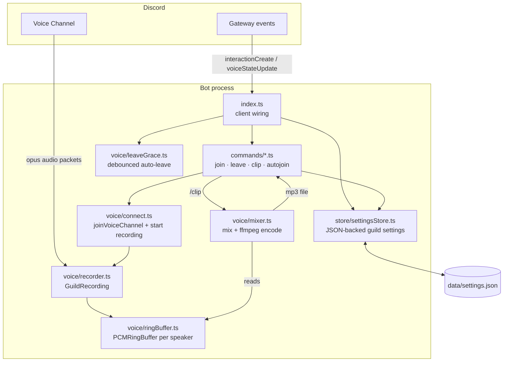
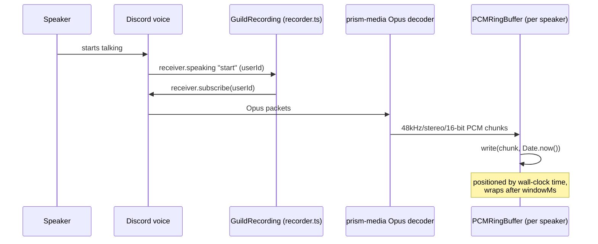
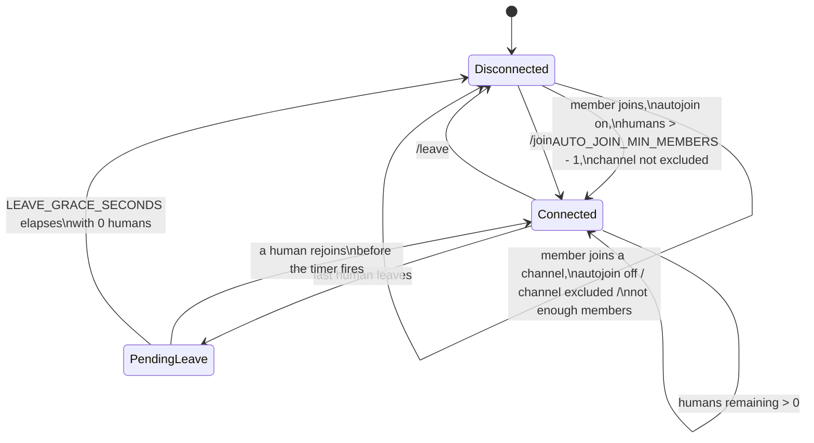

# Discord Audio Clipper — End-to-End Guide

This is the deep-dive companion to the [README](../README.md): how the bot is
built, how audio actually flows through it, every command and config option,
how to run it in production, and how to debug it when something goes wrong.

## Contents

1. [Overview](#1-overview)
2. [Architecture](#2-architecture)
3. [The recording pipeline](#3-the-recording-pipeline)
4. [Auto-join, auto-leave, and the leave grace period](#4-auto-join-auto-leave-and-the-leave-grace-period)
5. [Settings persistence](#5-settings-persistence)
6. [Setup, from zero](#6-setup-from-zero)
7. [Configuration reference](#7-configuration-reference)
8. [Command reference](#8-command-reference)
9. [Running in production](#9-running-in-production)
10. [Troubleshooting](#10-troubleshooting)
11. [Project layout / extending the bot](#11-project-layout--extending-the-bot)

---

## 1. Overview

The bot solves one problem: **"someone said something funny/important five
minutes ago, I wish I'd been recording."** Instead of recording on demand
(too late) or recording and saving everything forever (a privacy and storage
problem), it keeps a small rolling buffer of the last few minutes per
speaker, in memory only, and only turns that into a real file when someone
explicitly asks for a clip.

Nothing touches disk while recording. A clip only exists as a file for the
few seconds between "someone ran `/clip`" and "Discord finished receiving
the upload," after which it's deleted.

## 2. Architecture



- **`index.ts`** owns the Discord client, dispatches slash-command
  interactions to the matching `commands/*.ts` module, and holds the
  `voiceStateUpdate` listener that drives auto-join and auto-leave.
- **`commands/`** — one file per slash command (`join`, `leave`, `clip`,
  `autojoin`). Each exports a `Command` (`data` = the slash command
  definition, `execute` = the handler).
- **`voice/connect.ts`** wraps `@discordjs/voice`'s `joinVoiceChannel` +
  waiting for the `Ready` state, then hands the connection to the recorder.
  Both `/join` and auto-join call this so there's exactly one code path for
  "connect and start recording."
- **`voice/recorder.ts`** owns one `GuildRecording` per guild that's
  currently connected. It subscribes to each user's Opus audio as they start
  speaking and decodes it to PCM.
- **`voice/ringBuffer.ts`** is a fixed-size circular buffer of raw PCM,
  one per speaker, indexed by wall-clock time (see [§3](#3-the-recording-pipeline)).
- **`voice/mixer.ts`** is only invoked by `/clip`: it reads the requested
  window from every speaker's ring buffer, sums them into one mix, and
  shells out to `ffmpeg` to encode an mp3.
- **`voice/leaveGrace.ts`** holds the per-guild "about to leave" timers used
  by auto-leave (see [§4](#4-auto-join-auto-leave-and-the-leave-grace-period)).
- **`store/settingsStore.ts`** is the only piece of state that outlives a
  process restart — see [§5](#5-settings-persistence).

## 3. The recording pipeline



1. **Join.** `/join` (or auto-join) calls `connectAndRecord`, which opens a
   voice connection and calls `recorder.startRecording(guildId, connection)`.
   That creates a `GuildRecording`, which listens for the connection's
   `receiver.speaking` `"start"` event.
2. **Per-speaker subscription.** The first time a user speaks, the recorder
   subscribes to their Opus stream (`EndBehaviorType.AfterSilence`, closing
   after 100ms of silence) and pipes it through `prism-media`'s Opus decoder
   to get raw PCM. It re-subscribes automatically the next time they speak
   after a silence-triggered close.
3. **Writing into the ring buffer.** Each speaker gets their own
   `PCMRingBuffer` (created lazily, sized to `RECORD_WINDOW_SECONDS`). Writes
   are positioned **by wall-clock time**, not arrival order: `write()` fills
   any gap since the last write with silence and always writes at
   `posFor(timestamp)`. This is what lets `/clip` mix multiple speakers by
   simple index-aligned addition — sample *N* in every user's buffer
   corresponds to the same instant — instead of needing to timestamp-align
   streams after the fact.
4. **Clipping.** `/clip [seconds]` calls `mixer.createClip`, which:
   - computes `[startMs, endMs)` for the requested window, clamped to both
     `RECORD_WINDOW_SECONDS` and how long the bot has actually been
     recording (so you can't get silence-padding from before you joined);
   - reads that window out of every speaker's ring buffer;
   - sums the buffers sample-by-sample into one `Int32Array`, then scales
     the whole mix down by its peak (not per-sample clipping) so multiple
     people talking at once doesn't distort;
   - pipes the mixed PCM into `ffmpeg` (via `fluent-ffmpeg` +
     `ffmpeg-static`, no system ffmpeg install needed) and encodes to a
     128kbps mp3 in the OS temp directory;
   - the command handler uploads that file as a Discord attachment, then
     calls `mixer.cleanupClip` to delete it.
5. **Leaving.** `recorder.stopRecording(guildId)` unhooks the `speaking`
   listener and drops all buffers — recorded audio for that guild is gone
   the moment the bot leaves.

## 4. Auto-join, auto-leave, and the leave grace period

`index.ts`'s `voiceStateUpdate` handler runs on every join/leave/move in
every voice channel and does two unrelated things depending on whether the
bot is already connected in that guild:



- **Bot already connected in this guild:** count humans left in the bot's
  current channel. Zero humans schedules an auto-leave via
  `leaveGrace.scheduleLeave` (a no-op if one's already pending); anyone
  present cancels a pending one. The scheduled callback re-checks the
  channel when it actually fires — if everyone left and came back within
  `LEAVE_GRACE_SECONDS`, nothing happens. This exists because a client hiccup
  or a quick channel hop used to instantly kill the recording buffer.
- **Bot not connected in this guild:** if `/autojoin enable` has been run
  for the guild, the channel the member just joined isn't on the exclude
  list, and it now has more than `AUTO_JOIN_MIN_MEMBERS - 1` humans in it,
  the bot calls the same `connectAndRecord` helper `/join` uses.

`/leave` bypasses all of this: it cancels any pending scheduled leave and
destroys the connection immediately.

## 5. Settings persistence

`/autojoin`'s enabled/disabled state and excluded-channel list are the only
state that needs to survive a restart (recording buffers are intentionally
ephemeral). `store/settingsStore.ts` keeps an in-memory `Record<guildId,
GuildSettings>` that's read from `<DATA_DIR>/settings.json` on startup and
rewritten (via write-to-temp-file-then-rename, so a crash mid-write can't
corrupt it) after every change:

```json
{
  "123456789012345678": {
    "autoJoinEnabled": true,
    "autoJoinExcludedChannelIds": ["234567890123456789"]
  }
}
```

`DATA_DIR` defaults to `./data` (gitignored) and can point anywhere writable
— see [§7](#7-configuration-reference) if you need it on a persistent volume
in a container.

## 6. Setup, from zero

1. **Create the Discord application.**
   [Discord Developer Portal](https://discord.com/developers/applications) →
   New Application. Under **Bot**, copy the token (you'll only see it once —
   regenerate it if you lose it). Under **OAuth2 → General**, copy the
   Application (Client) ID.
2. **No privileged intents needed.** The bot only uses `Guilds` and
   `GuildVoiceStates`, neither of which requires enabling anything under
   **Bot → Privileged Gateway Intents**.
3. **Invite the bot.** Build an invite URL with the `bot` and
   `applications.commands` scopes and the **Connect**, **Speak**, and
   **View Channel** permissions (Speak isn't strictly needed — the bot never
   plays audio — but some clients want it to fully join a channel). You can
   generate this URL from **OAuth2 → URL Generator** in the portal.
4. **Install dependencies:**
   ```bash
   npm install
   ```
5. **Configure.** Copy `.env.example` to `.env` and fill in `DISCORD_TOKEN`
   and `CLIENT_ID`. Set `GUILD_ID` too while developing — guild-scoped
   commands register instantly, global ones can take up to an hour to
   propagate.
6. **Build:**
   ```bash
   npm run build
   ```
7. **Register the slash commands** (needed once, and again any time a
   command's definition changes — e.g. after upgrading past the `/autojoin`
   subcommand restructure):
   ```bash
   npm run deploy-commands
   ```
8. **Start the bot:**
   ```bash
   npm start
   ```

During development, skip the build step with `npm run dev` and
`npm run deploy-commands:dev` (both run the TypeScript sources directly via
`ts-node`).

## 7. Configuration reference

Everything is read once at startup from `.env` (via `dotenv`) or the process
environment — there's no live-reload, so restart after changing any of
these.

| Variable                | Required | Default   | Description |
|--------------------------|:--------:|-----------|--------------|
| `DISCORD_TOKEN`          | ✅       | —         | Bot token from the Developer Portal. |
| `CLIENT_ID`              | ✅       | —         | Application/client ID. |
| `GUILD_ID`               |          | *(global)* | If set, `deploy-commands` registers commands to this one guild instead of globally. Guild commands update instantly; global commands can take up to an hour. |
| `RECORD_WINDOW_SECONDS`  |          | `300`     | Size of the rolling per-speaker buffer. `/clip` can never return more than this, and memory use scales with it (roughly `RECORD_WINDOW_SECONDS × 192 KB` per distinct speaker). |
| `DEFAULT_CLIP_SECONDS`   |          | `300`     | How much `/clip` returns when called with no `seconds` argument. |
| `AUTO_JOIN_MIN_MEMBERS`  |          | `4`       | Auto-join fires once a channel has at least this many non-bot members — "more than 3" means `4`. Only takes effect in guilds where `/autojoin enable` has been run. |
| `LEAVE_GRACE_SECONDS`    |          | `10`      | Delay after a channel empties before the bot actually disconnects, to absorb brief drop-and-rejoin blips. |
| `DATA_DIR`               |          | `./data`  | Directory holding `settings.json` (auto-join on/off + excluded channels per guild). Must be writable; point it at a persistent volume in containerized deployments. |

## 8. Command reference

All commands are guild-only. If the bot is installed with only the
`applications.commands` scope (no bot-user membership), every command
replies explaining that instead of silently timing out.

### `/join`

Connects to the voice channel you're currently in and starts recording.
Fails with "You need to be in a voice channel first" if you're not in one,
or "Could not connect to the voice channel in time" if the connection
doesn't reach the `Ready` state within 15 seconds (usually a permissions or
Discord-outage issue — see [§10](#10-troubleshooting)).

### `/leave`

Disconnects and immediately drops all recording buffers for the guild.
Replies "I'm not in a voice channel" if there's nothing to leave.

### `/clip [seconds]`

Mixes every speaker's buffer for the requested window and uploads an mp3.

- `seconds` is optional, defaults to `DEFAULT_CLIP_SECONDS`, and is capped
  at `RECORD_WINDOW_SECONDS` by the option's own min/max.
- If the bot hasn't been recording that long yet, the reply says so and
  returns whatever's actually been captured instead of padding with
  silence.
- Replies "I'm not currently recording in this server" if the bot isn't
  connected — run `/join` (or enable auto-join) first.

### `/autojoin`

Subcommands, all guild-scoped and persisted (see [§5](#5-settings-persistence)):

| Subcommand | Effect |
|---|---|
| `/autojoin enable` | Turns auto-join on for this server. |
| `/autojoin disable` | Turns auto-join off for this server. |
| `/autojoin status` | Shows on/off state and the current excluded-channel list. |
| `/autojoin exclude add <channel>` | Adds a voice/stage channel to the exclude list — it will never trigger auto-join, even above the member threshold. Useful for an AFK or lobby channel. |
| `/autojoin exclude remove <channel>` | Removes a channel from the exclude list. |

Auto-join itself only ever *joins*; it never overrides a manual `/leave`,
and it won't reconnect the bot into a different channel in the same guild
while it's already connected somewhere.

## 9. Running in production

The build output is plain Node — any process manager works. A minimal
`systemd` unit:

```ini
[Unit]
Description=discord-audio-clipper
After=network-online.target

[Service]
WorkingDirectory=/opt/discord-audio-clipper
EnvironmentFile=/opt/discord-audio-clipper/.env
ExecStart=/usr/bin/node dist/index.js
Restart=on-failure
RestartSec=5

[Install]
WantedBy=multi-user.target
```

Notes:

- Run `npm run build` as part of your deploy step; `npm start` (or the
  `ExecStart` above) only runs the compiled `dist/`.
- `npm run deploy-commands` only needs to run again when a command's
  *definition* changes (new option, renamed subcommand, etc.) — not on every
  deploy.
- Make sure `DATA_DIR` points somewhere that persists across deploys/restarts
  (a bind mount or volume, not an ephemeral container filesystem), or
  auto-join settings will silently reset.
- The process holds no other state worth persisting — recording buffers are
  meant to be lost on restart.
- ffmpeg is bundled via `ffmpeg-static`; no system package to install. Voice
  decode/encrypt use the pure-JS `opusscript` and `libsodium-wrappers`, so
  there's no native build step either — if CPU use under many concurrent
  guilds becomes a problem, installing `@discordjs/opus` and `sodium-native`
  alongside the existing deps lets `prism-media`/`@discordjs/voice` pick them
  up automatically as faster drop-ins.

## 10. Troubleshooting

**"Could not connect to the voice channel in time."**
The connection didn't reach `Ready` within 15s. Usually: the bot lacks
**Connect** permission on that channel, the channel is full and permission
to bypass the user limit is missing, or Discord's voice infra is degraded.
Check the bot's role permissions in that specific channel (channel overrides
can revoke server-level permissions).

**"I'm not a member of this server, so I can't use its voice channels."**
The app was invited with only the `applications.commands` scope. Re-invite
with both `bot` and `applications.commands`.

**Slash commands don't show up, or show old options (e.g. `/autojoin`'s
old boolean `enabled` option instead of subcommands).**
Command definitions aren't live — you must re-run `npm run deploy-commands`
(or `:dev`) after changing a command's `SlashCommandBuilder`. Global
registration can also take up to an hour to propagate; set `GUILD_ID` while
iterating.

**Auto-join isn't triggering even with enough people in the channel.**
Check, in order: `/autojoin status` (is it actually enabled for this guild?
is that channel on the exclude list?), whether the bot is already connected
somewhere else in the guild (it won't jump channels while connected), and
`AUTO_JOIN_MIN_MEMBERS` (the count must be *greater than* threshold − 1,
i.e. strictly more than 3 by default).

**The bot leaves the instant everyone drops, even though I raised
`LEAVE_GRACE_SECONDS`.**
Confirm the env var is actually picked up — it's read once at process start,
so an edited `.env` needs a restart. Also note `/leave` always disconnects
immediately regardless of this setting; it's only for the automatic
everyone-left-the-channel path.

**`/clip` returns less audio than requested.**
Expected if the bot hasn't been connected that long yet — the reply says so
explicitly. If it's short even on a long-running session, check
`RECORD_WINDOW_SECONDS`; the buffer can never hold more than that regardless
of what `/clip`'s `seconds` argument asks for.

**Auto-join/exclude settings reset after a redeploy.**
`DATA_DIR` (default `./data`) isn't persisted across deploys in your
environment. Point it at a volume that survives redeploys.

## 11. Project layout / extending the bot

```
src/
  config.ts              env var loading + defaults
  types.ts                Command interface, discord.js Client augmentation
  index.ts                client wiring, interaction dispatch, voiceStateUpdate
  deploy-commands.ts      registers all commands' .data with Discord's API
  commands/
    join.ts
    leave.ts
    clip.ts
    autojoin.ts
  voice/
    connect.ts             shared "join channel + start recording" helper
    recorder.ts             GuildRecording: per-guild subscription lifecycle
    ringBuffer.ts            PCMRingBuffer: time-indexed circular PCM buffer
    mixer.ts                 mixdown + ffmpeg encode for /clip
    leaveGrace.ts            debounce timers for auto-leave
  store/
    settingsStore.ts         JSON-backed per-guild settings
```

**Adding a new slash command:** create `src/commands/yourcommand.ts`
exporting a default `Command` (see any existing command for the shape),
then add it to the `commands` array in both `src/index.ts` (so it's
dispatched) and `src/deploy-commands.ts` (so Discord knows about it) —
and re-run `npm run deploy-commands`.

**Adding new per-guild config:** extend `GuildSettings` in
`store/settingsStore.ts`, add a getter/setter, and update `DEFAULT_SETTINGS`
— existing `settings.json` files on disk will pick up the new default the
first time they're read, since `getGuildSettings` merges over
`DEFAULT_SETTINGS`.
